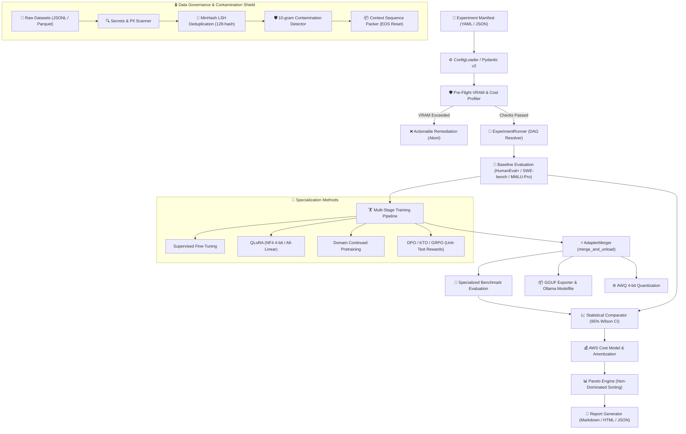

<div align="center">

# ⚡ ViForge — Forging Small Models into Specialists

**An End-to-End Post-Training, Evaluation & Pareto-Optimality Platform**

[](https://www.python.org/downloads/)
[](https://pytorch.org/)
[](https://opensource.org/licenses/MIT)
[]()
[](https://github.com/astral-sh/ruff)
[]()
[]()

<p align="center">
  <a href="#-key-features">Key Features</a> •
  <a href="#-architecture">Architecture</a> •
  <a href="#-quickstart">Quickstart</a> •
  <a href="#-cli-command-suite">CLI Suite</a> •
  <a href="#-core-research-hypothesis">Research & Math</a> •
  <a href="#-benchmark-matrix">Benchmarks</a> •
  <a href="#-export--deployment">Export & Deployment</a> •
  <a href="#-citation">Citation</a>
</p>

</div>

---

## 🎯 What is ViForge?

**ViForge** is a production-grade open-source post-training experimentation platform and empirical evaluation framework. It systematically transforms cost-efficient general-purpose base models (such as **DeepSeek V4 Pro**, Llama 3, Qwen 2.5, and Mistral) into high-performing domain experts for **Software Engineering** and reasoning tasks.

Rather than assuming fine-tuning is always optimal, ViForge rigorously tests:

> **"How much task-specific capability can we add to a small or cost-efficient model before its economic and computational advantage disappears?"**

---

## ✨ Key Features

<table>
  <tr>
    <td width="50%">
      <h3>🛡️ Pre-Flight VRAM & Cost Profiler</h3>
      Analytical memory modeling ($M_{\text{weights}} + M_{\text{grads}} + M_{\text{optim}} + M_{\text{act}}$) with a 15% safety headroom. Prevents Out-Of-Memory (OOM) failures before allocating expensive cloud GPU clusters.
    </td>
    <td width="50%">
      <h3>🧬 Multi-Stage Specialization Taxonomy</h3>
      Modular training plugin architecture supporting <b>SFT</b>, <b>LoRA</b>, <b>QLoRA (NF4 4-bit)</b>, <b>Continued Pretraining (CPT/DAPT)</b>, <b>DPO</b>, <b>KTO</b>, and <b>GRPO</b> with deterministic unit-test rewards.
    </td>
  </tr>
  <tr>
    <td width="50%">
      <h3>🔒 10-Gram Contamination & Data Shield</h3>
      Full data governance with <b>MinHash LSH deduplication</b> (128 permutation hashes), 10-gram sliding window benchmark leakage detection, TruffleHog secrets scanning, and automated PII redaction.
    </td>
    <td width="50%">
      <h3>📊 Multi-Objective Pareto Frontier</h3>
      Quantifies trade-offs across 5 dimensions: <i>Domain Quality</i>, <i>Generalist Retention</i>, <i>Training Cost (USD)</i>, <i>Inference Latency</i>, and <i>Memory Footprint</i>.
    </td>
  </tr>
  <tr>
    <td width="50%">
      <h3>⚡ Kernel & Compute Acceleration</h3>
      Drop-in support for <b>Liger-Kernel</b> (Triton fused RMSNorm, CrossEntropy, SwiGLU) and <b>FlashAttention-2</b>, reducing VRAM footprint by 30–50% during training.
    </td>
    <td width="50%">
      <h3>📦 One-Click GGUF, Ollama & AWQ Export</h3>
      Instant <code>merge_and_unload</code> of adapters, export to <b>GGUF</b> (<code>Q4_K_M</code>, <code>Q5_K_M</code>, <code>Q8_0</code>), auto-generation of Ollama <code>Modelfile</code>, and 4-bit <b>AWQ</b> quantization.
    </td>
  </tr>
</table>

---

## 🏛️ Architecture & End-to-End Pipeline



---

## 📐 The Core Research Hypothesis & Mathematics

ViForge answers whether post-training specialization provides a true economic and operational advantage over larger frontier models via the **Capability-per-Dollar Index**:

$$\text{Capability-per-Dollar} = \frac{\Delta \mathcal{S}_{\text{domain}} - \lambda \cdot \max(0, -\Delta \mathcal{S}_{\text{general}})}{\mathcal{C}_{\text{train}} + \mathcal{C}_{\text{infer}}(N_{\text{tokens}})}$$

Where:
- $\Delta \mathcal{S}_{\text{domain}}$ is the relative gain on target software engineering benchmarks (e.g. HumanEval+, SWE-bench Lite).
- $\Delta \mathcal{S}_{\text{general}}$ measures catastrophic forgetting on retention benchmarks (MMLU-Pro, GSM8K, ARC-Challenge).
- $\lambda \ge 0$ is the retention penalty factor (default $\lambda = 1.0$).
- $\mathcal{C}_{\text{train}}$ is the total amortized compute cost for data curation, pretraining, and fine-tuning.
- $\mathcal{C}_{\text{infer}}(N_{\text{tokens}})$ is the projected operational inference cost for serving $N$ tokens.

### Statistical Rigor (95% Wilson Score Confidence Interval)
To ensure benchmark improvements are statistically significant and not sampling noise, pass rates $\hat{p} = k / n$ are bound by the Wilson score interval:

$$\text{CI}_{95\%} = \frac{\hat{p} + \frac{z^2}{2n} \pm z \sqrt{\frac{\hat{p}(1-\hat{p})}{n} + \frac{z^2}{4n^2}}}{1 + \frac{z^2}{n}}, \quad z = 1.960$$

---

## 🚀 Quickstart

### 1. Installation

```bash
# Clone repository
git clone https://github.com/vfcarida/ViForge.git
cd ViForge

# Option A: Pinned reproducible installation (recommended for research & CI)
pip install -r requirements/dev.lock
pip install -e . --no-deps

# Option B: Standard editable install with dev dependencies
pip install -e ".[dev]"
```

### 🔒 Reproducible Lockfile Management

ViForge maintains cryptographically hashed lockfiles in `requirements/` to guarantee deterministic builds and exact environment replication across researcher workstations and CI/CD pipelines:

- `requirements/base.lock` — Core runtime dependencies
- `requirements/dev.lock` — Development, test, and linting tooling
- `requirements/all.lock` — Full stack (core, dev, AWS SageMaker/S3, and inference)

To regenerate all lockfiles from `pyproject.toml`:

```bash
# Using Makefile
make lock

pip-compile pyproject.toml -o requirements/base.lock --generate-hashes --allow-unsafe
pip-compile pyproject.toml --extra dev -o requirements/dev.lock --generate-hashes --allow-unsafe
pip-compile pyproject.toml --extra dev --extra aws --extra inference -o requirements/all.lock --generate-hashes --allow-unsafe
```


### 2. Environment Diagnostics (Doctor)

Inspect local hardware, RAM, disk space, PyTorch, CUDA, and accelerator status:

```bash
viforge doctor
```

### 3. Run the DeepSeek V4 Pro SWE Experiment Campaign

Execute the complete end-to-end specialization pipeline (Profiling $\rightarrow$ Baseline $\rightarrow$ Specialization $\rightarrow$ Evaluation $\rightarrow$ Pareto Optimization $\rightarrow$ Reporting):

```bash
# Run full campaign (using deterministic mock engine for fast local validation)
viforge run configs/experiments/deepseek_v4_pro_software_engineering.yaml --mock

# Run on live GPU hardware with Hugging Face transformers / CUDA:
viforge run configs/experiments/deepseek_v4_pro_software_engineering.yaml --live
```

---

## 💻 CLI Command Suite

ViForge provides 15 unified CLI subcommands for every stage of the post-training lifecycle:

| Command | Description |
| :--- | :--- |
| `viforge doctor` | Inspect system environment, CPU, RAM, disk, CUDA devices, and package versions. |
| `viforge validate <config>` | Validate experiment manifest against strict Pydantic v2 schemas. |
| `viforge prepare-data <config>` | Ingest, deduplicate (MinHash LSH), and decontaminate datasets against benchmarks. |
| `viforge train <config>` | Run pre-flight VRAM profiling, cost estimation, and execute training stages. |
| `viforge baseline <config>` | Run baseline benchmark evaluation on the non-fine-tuned base model. |
| `viforge evaluate <config>` | Evaluate the merged specialist model across domain and retention test suites. |
| `viforge compare <config>` | Compute statistical deltas, relative gains, and 95% Wilson confidence intervals. |
| `viforge analyze <config>` | Compute multi-objective non-dominated Pareto frontier and capability-per-dollar scores. |
| `viforge report <config>` | Generate comprehensive Markdown, HTML, and JSON summary reports. |
| `viforge export-gguf <model>` | Export merged model to GGUF format and generate ready-to-run Ollama `Modelfile`. |
| `viforge quantize <model>` | Apply AWQ 4-bit activation-aware weight quantization for low-VRAM inference. |
| `viforge run <config>` | Execute complete end-to-end experimentation workflow in a single command. |
| `viforge list-methods` | List all registered specialization methods (SFT, LoRA, QLoRA, CPT, DPO, GRPO). |
| `viforge list-datasets` | List registered datasets and inspect SHA-256 governance manifests. |
| `viforge list-evaluators` | List registered domain benchmarks and general capability retention suites. |

---

## 🔬 Benchmark & Evaluation Matrix

ViForge implements a dual evaluation harness to track both **Domain Gain** and **Generalist Capability Retention**:

```text
EVALUATION MATRIX
├── Domain Benchmarks (Software Engineering)
│   ├── HumanEval+ (80x expanded mutation tests via EvalPlus)
│   ├── MBPP+ (Multi-test Python coding benchmark)
│   ├── SWE-bench Lite (Real-world GitHub issue resolution & patch verification)
│   └── LiveCodeBench (Holistic, contamination-free code evaluation)
└── Generalist Retention Benchmarks (Catastrophic Forgetting Defense)
    ├── MMLU-Pro (Challenging multi-discipline reasoning)
    ├── GSM8K (Multi-step mathematical reasoning)
    └── ARC-Challenge (Advanced scientific question answering)
```

---

## 📦 Export & Local Edge Deployment

### 1. Export to GGUF & Run with Ollama

Export your trained specialist model directly into GGUF format with an automated ChatML template:

```bash
# Export to GGUF Q4_K_M with Ollama Modelfile
viforge export-gguf runs/deepseek_v4_pro/checkpoints/stage_1_sft \
  --output-dir exports/gguf \
  --quant-type Q4_K_M

# Register and run with Ollama
ollama create deepseek-swe-specialist -f exports/gguf/Modelfile
ollama run deepseek-swe-specialist "Implement a thread-safe LRU cache with TTL in Python"
```

### 2. AWQ Quantization for vLLM High-Throughput Serving

```bash
# Quantize model to 4-bit AWQ
viforge quantize runs/deepseek_v4_pro/checkpoints/stage_1_sft \
  --output-dir exports/awq \
  --bits 4 \
  --group-size 128
```

---

## 📁 Repository Structure

```text
ViForge/
├── src/
│   └── viforge/
│       ├── cli/                 # Typer CLI subcommands & rich terminal tables
│       ├── config/              # Pydantic v2 schemas, loaders, validation models
│       ├── models/              # Model registry, target module resolver, HF adapters
│       ├── datasets/            # Dataset adapters, SHA-256 governance manifests
│       ├── preprocessing/       # AST normalizer, MinHash LSH, Contamination shield, Sequence packer
│       ├── training/            # Pre-flight VRAM profiler, FLOPs/cost estimator, Liger-kernel, Backends
│       ├── methods/             # SFT, LoRA, QLoRA (NF4), CPT, DPO, KTO, GRPO, Synthetic SFT
│       ├── inference/           # Deterministic inference client & Mock/HF backends
│       ├── evaluation/          # Sandboxed evaluation suites (HumanEval+, SWE-bench, Retention)
│       ├── metrics/             # Wilson score confidence intervals, statistical deltas
│       ├── cost/                # Amortized financial cost model & Capability-per-Dollar index
│       ├── artifacts/           # Adapter merger, GGUF exporter, Ollama Modelfile, AWQ quantizer
│       ├── experiments/         # Stage DAG dependency resolver & Experiment campaign runner
│       ├── analysis/            # Multi-objective non-dominated Pareto frontier engine
│       ├── reporting/           # Markdown, HTML, JSON report generators
│       ├── aws/                 # S3 multipart sync, SageMaker runners, Resource cleanup
│       ├── security/            # TruffleHog secrets scanner, PII filter, Subprocess sandbox
│       └── utils/               # Rich logging, System diagnostics doctor, SHA-256 hashing
├── configs/                     # YAML configuration manifests for models, datasets, methods, and runs
├── docs/                        # Complete architecture, research, audit, ADRs, and testing guides
├── tests/                       # Unit, contract, integration, smoke, and e2e test suites (30 tests)
├── docker/                      # Multi-stage Dockerfile, CPU, and GPU CUDA 12.2 container images
├── examples/                    # Python API quickstart and custom benchmark plugin authoring
├── requirements/                # Cryptographically pinned lockfiles (base.lock, dev.lock, all.lock)
├── Makefile                     # Build automation and lockfile generation targets
└── pyproject.toml               # Build system, package metadata, and entrypoints
```

---

## 🧪 Testing & Verification

ViForge is built with rigorous test-driven engineering. All tests run offline with deterministic fakes and zero external API dependencies:

```bash
# Run full test suite (30/30 passing)
pytest tests/ -v

# Run with test coverage report
pytest tests/ --cov=src/viforge --cov-report=term-missing

# Run static linting and type checks
ruff check src/ tests/
```

---

## 📄 License & Open Source Governance

ViForge is licensed under the [MIT License](LICENSE).

---

## 📚 Citation

If you use ViForge in your research or post-training workflows, please cite:

```bibtex
@software{viforge2026,
  author = {ViForge Contributors},
  title = {ViForge: Forging Small Models into Specialists with Empirical Pareto-Optimality Analysis},
  url = {https://github.com/vfcarida/ViForge},
  year = {2026}
}
```
