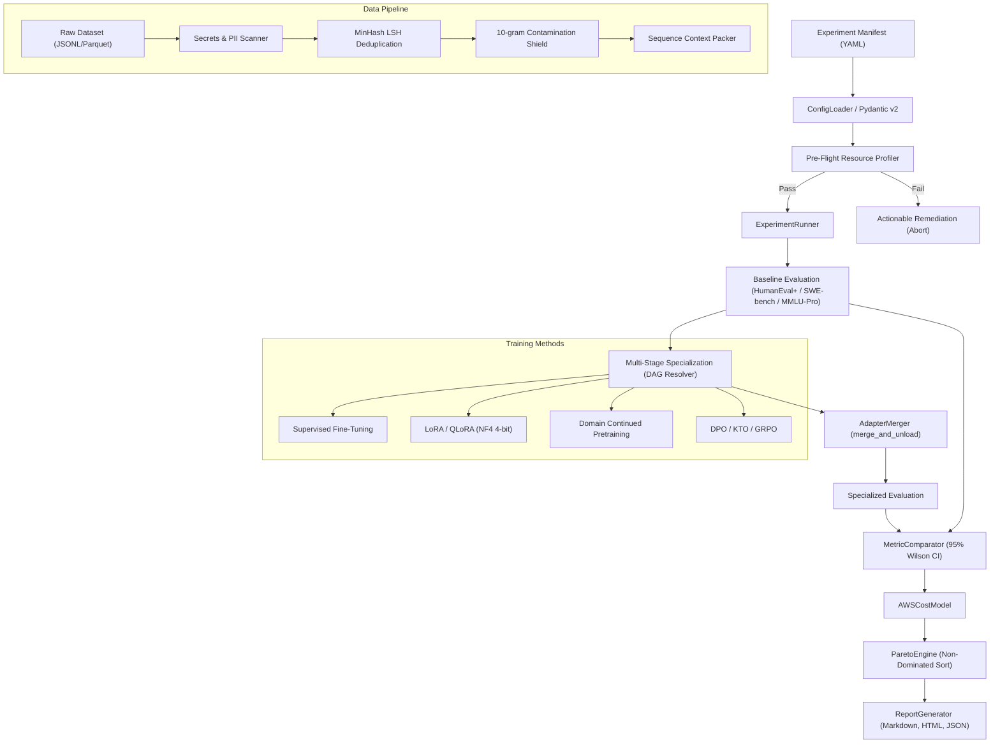

# ViForge Current Architecture

```mermaid
flowchart TD
    Config["Experiment Manifest (YAML)"] --> Loader["ConfigLoader / Pydantic v2"]
    Loader --> Profiler["Pre-Flight Resource Profiler"]
    Profiler -->|Pass| Runner["ExperimentRunner"]
    Profiler -->|Fail| FailFast["Actionable Remediation (Abort)"]

    subgraph Data Pipeline
        RawData["Raw Dataset (JSONL/Parquet)"] --> Scanner["Secrets & PII Scanner"]
        Scanner --> Dedup["MinHash LSH Deduplication"]
        Dedup --> Contam["10-gram Contamination Shield"]
        Contam --> Packer["Sequence Context Packer"]
    end

    Runner --> BaseEval["Baseline Evaluation (HumanEval+ / SWE-bench / MMLU-Pro)"]
    BaseEval --> TrainingStages["Multi-Stage Specialization (DAG Resolver)"]

    subgraph Training Methods
        TrainingStages --> SFT["Supervised Fine-Tuning"]
        TrainingStages --> LoRA["LoRA / QLoRA (NF4 4-bit)"]
        TrainingStages --> CPT["Domain Continued Pretraining"]
        TrainingStages --> Preference["DPO / KTO / GRPO"]
    end

    TrainingStages --> Merger["AdapterMerger (merge_and_unload)"]
    Merger --> SpecEval["Specialized Evaluation"]

    BaseEval & SpecEval --> Comparator["MetricComparator (95% Wilson CI)"]
    Comparator --> Cost["AWSCostModel"]
    Cost --> Pareto["ParetoEngine (Non-Dominated Sort)"]
    Pareto --> Reporting["ReportGenerator (Markdown, HTML, JSON)"]
```
