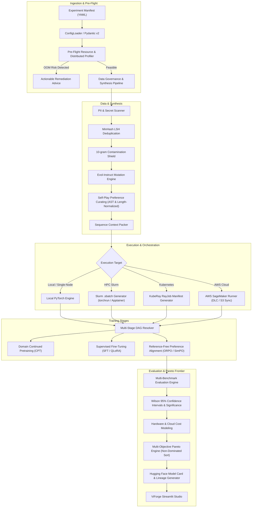

# ViForge Architectural Overview

ViForge is an enterprise post-training and evaluation framework specifically engineered to forge Small Language Models (SLMs) into domain specialists.

---

## High-Level Architecture Diagram

---

## Core Subsystems

| Subsystem | Key Modules | Primary Responsibilities |
| :--- | :--- | :--- |
| **[Distributed Profiler](distributed_training.md)** | `viforge.training.profiler`, `viforge.training.distributed` | Analytical VRAM estimation (DDP, ZeRO-1/2/3, FSDP2, CPU Offload), Accelerate YAML and DeepSpeed JSON auto-generation. |
| **[Synthetic Data & Self-Play](synthetic_data.md)** | `viforge.methods.synthetic`, `viforge.preprocessing.contamination` | Evol-Instruct prompt mutation (deepen, broaden, reasoning, concretize), AST code verification, length-bias mitigation, contamination prevention. |
| **[Cluster Orchestration](orchestration.md)** | `viforge.orchestration.slurm`, `viforge.orchestration.ray`, `viforge.aws.sagemaker` | Slurm HPC `.sbatch` generation, Kubernetes KubeRay `RayJob` YAML generation, and AWS SageMaker managed execution. |
| **[Unified Pareto Engine](unified_pareto.md)** | `viforge.reporting.pareto`, `viforge.reporting.model_card` | Non-dominated sorting, Wilson 95% confidence intervals, Hugging Face Hub standard `README.md` model cards, cryptographic lineage. |
| **[Reference-Free Alignment](../research/reference_free_alignment.md)** | `viforge.methods.orpo`, `viforge.methods.simpo` | Memory-efficient preference alignment without reference model overhead. |
