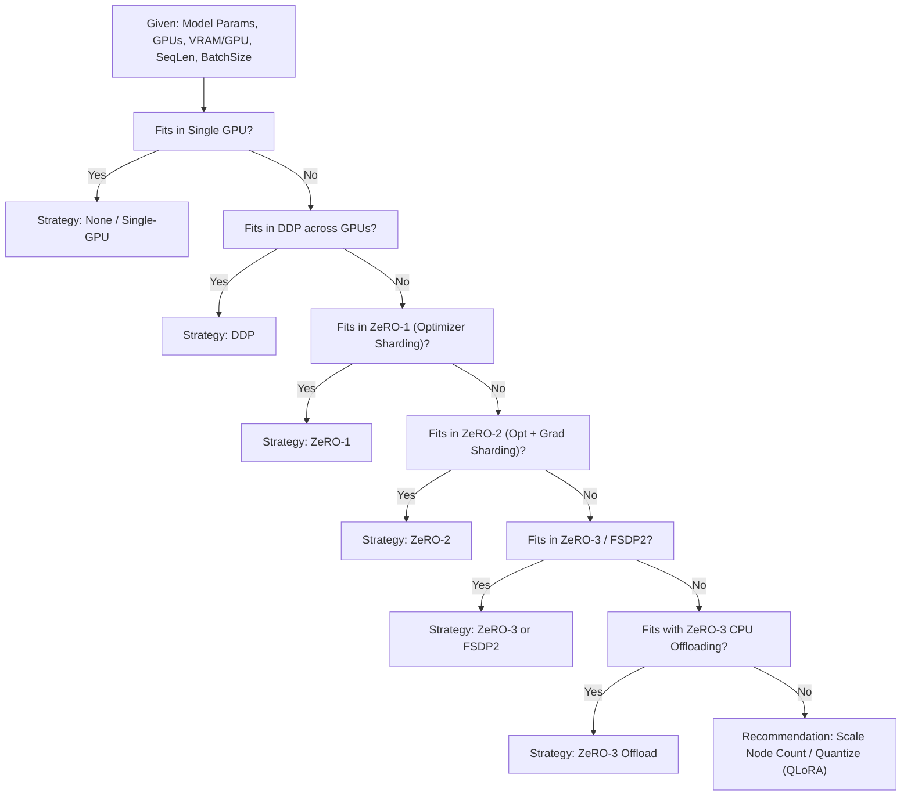

# Distributed Training & Memory Profiler

## Overview

Training or fine-tuning models from 7B to 70B+ parameters presents steep hardware requirements. Selecting the incorrect distributed strategy can cause Out-Of-Memory (OOM) fatal aborts, suboptimal GPU compute utilization, or prohibitive cluster cost.

**ViForge** provides an **Analytical Distributed Profiler** and **Automated Config Generator** that calculate exact tensor and activation memory footprints across parallelization strategies without requiring hardware pre-allocation.

---

## Analytical Memory Breakdown Formulae

For a model with $\Phi$ billion parameters in mixed precision ($\text{FP16}$ or $\text{BF16}$, 2 bytes per parameter) trained with an AdamW optimizer (first and second moments in $\text{FP32}$, plus master weights in $\text{FP32}$):

$$\text{Weight Memory} = 2 \cdot \Phi \text{ GB}$$

$$\text{Gradient Memory} = 2 \cdot \Phi \text{ GB}$$

$$\text{Optimizer States Memory} = 12 \cdot \Phi \text{ GB}$$

$$\text{Total Static Footprint (Single-GPU)} = 16 \cdot \Phi \text{ GB}$$

In addition, activation memory $\mathcal{A}$ depends on sequence length $S$, batch size $B$, number of transformer layers $L$, and hidden dimension $H$:

$$\mathcal{A} \approx B \cdot S \cdot L \cdot H \cdot \alpha$$

When gradient checkpointing is enabled, $\mathcal{A}$ is reduced by approximately $70\%$.

---

## Distributed Strategy Analytical Models

When scaling across $N$ GPUs:

| Strategy | Weights Memory | Gradients Memory | Optimizer States Memory | Activation Memory | Comm. Overhead |
| :--- | :--- | :--- | :--- | :--- | :--- |
| **DDP** (Standard Data Parallel) | $2\Phi$ | $2\Phi$ | $12\Phi$ | $\mathcal{A}$ | Low (AllReduce gradients) |
| **ZeRO-1** | $2\Phi$ | $2\Phi$ | $\frac{12\Phi}{N}$ | $\mathcal{A}$ | Low |
| **ZeRO-2** | $2\Phi$ | $\frac{2\Phi}{N}$ | $\frac{12\Phi}{N}$ | $\mathcal{A}$ | Moderate (ReduceScatter gradients) |
| **ZeRO-3** | $\frac{2\Phi}{N} + \text{buf}$ | $\frac{2\Phi}{N}$ | $\frac{12\Phi}{N}$ | $\frac{\mathcal{A}}{N}$ (with partition) | High (AllGather weights forward/backward) |
| **FSDP2** (Full Shard) | $\frac{2\Phi}{N}$ | $\frac{2\Phi}{N}$ | $\frac{12\Phi}{N}$ | $\mathcal{A}_{\text{layer}}$ (per-module stream) | Optimized overlapped CUDA streams |
| **CPU Offload** | $2\Phi$ or $\frac{2\Phi}{N}$ | $\frac{2\Phi}{N}$ | $0$ (Offloaded to Host RAM) | $\mathcal{A}$ | PCIe bound |

---

## Profiler Recommendation Decision Tree

The `recommend_distributed_strategy` engine evaluates the candidate topology against available GPU VRAM with a safety headroom margin (default: $15\%$ buffer):



---

## Automated Configuration Export

ViForge automatically compiles optimal configurations for both **Hugging Face Accelerate** and **DeepSpeed**:

### Accelerate Configuration (`accelerate_config.yaml`)

Supports:
- `MULTI_GPU` standard DDP
- `DEEPSPEED` ZeRO-1, ZeRO-2, ZeRO-3
- `FSDP` PyTorch FullyShardedDataParallel

### DeepSpeed Configuration (`deepspeed_zero*.json`)

Generates production-tuned configurations including:
- Dynamic loss scaling (`FP16` / `BF16`)
- Overlapped communication and reducer buffers
- ZeRO offload parameters (`pin_memory: true`, host RAM device mapping)

---

## Usage Examples

### CLI Command: Profiling Memory

```bash
viforge distributed-profile \
  --model-params 7.0 \
  --num-gpus 4 \
  --vram-per-gpu 24 \
  --batch-size 4 \
  --seq-length 4096
```

Output:
```text
======================================================================
VIFORGE DISTRIBUTED VRAM PROFILING REPORT
Model: 7.0B params | Cluster: 4 GPUs x 24.0 GB VRAM
======================================================================
Strategy        Static (GB)     Act (GB)        Total/GPU (GB)  Feasible
----------------------------------------------------------------------
Single-GPU      112.00          5.62            117.62          NO (OOM)
DDP             112.00          5.62            117.62          NO (OOM)
ZeRO-1          49.00           5.62            54.62           NO (OOM)
ZeRO-2          24.50           5.62            30.12           NO (OOM)
ZeRO-3          7.00            1.41            8.41            YES
FSDP2           7.00            1.41            8.41            YES
ZeRO-3-Offload  2.00            1.41            3.41            YES
----------------------------------------------------------------------
RECOMMENDED STRATEGY: ZeRO-3
Confidence: high | Expected Memory Headroom: 15.59 GB
======================================================================
```

### CLI Command: Exporting Configuration

```bash
viforge export-distributed-config \
  --strategy zero3 \
  --num-gpus 4 \
  --output-dir configs/distributed/
```

### Python API

```python
from viforge.training.profiler import profile_distributed_vram, recommend_distributed_strategy
from viforge.training.distributed import DistributedConfigGenerator

# 1. Profile distributed memory
profiles = profile_distributed_vram(
    model_params_billions=7.0,
    num_gpus=4,
    vram_per_gpu_gb=24.0,
    per_device_batch_size=4,
    seq_length=4096,
)

# 2. Get automated recommendation
recommendation = recommend_distributed_strategy(profiles, vram_per_gpu_gb=24.0)
print(f"Recommended Strategy: {recommendation['recommended_strategy']}")

# 3. Export Accelerate & DeepSpeed configs
acc_path = DistributedConfigGenerator.generate_accelerate_config(
    strategy=recommendation["recommended_strategy"],
    num_gpus=4,
    output_path="configs/accelerate_config.yaml",
)
ds_path = DistributedConfigGenerator.generate_deepspeed_config(
    strategy=recommendation["recommended_strategy"],
    output_path="configs/deepspeed_config.json",
)
```
