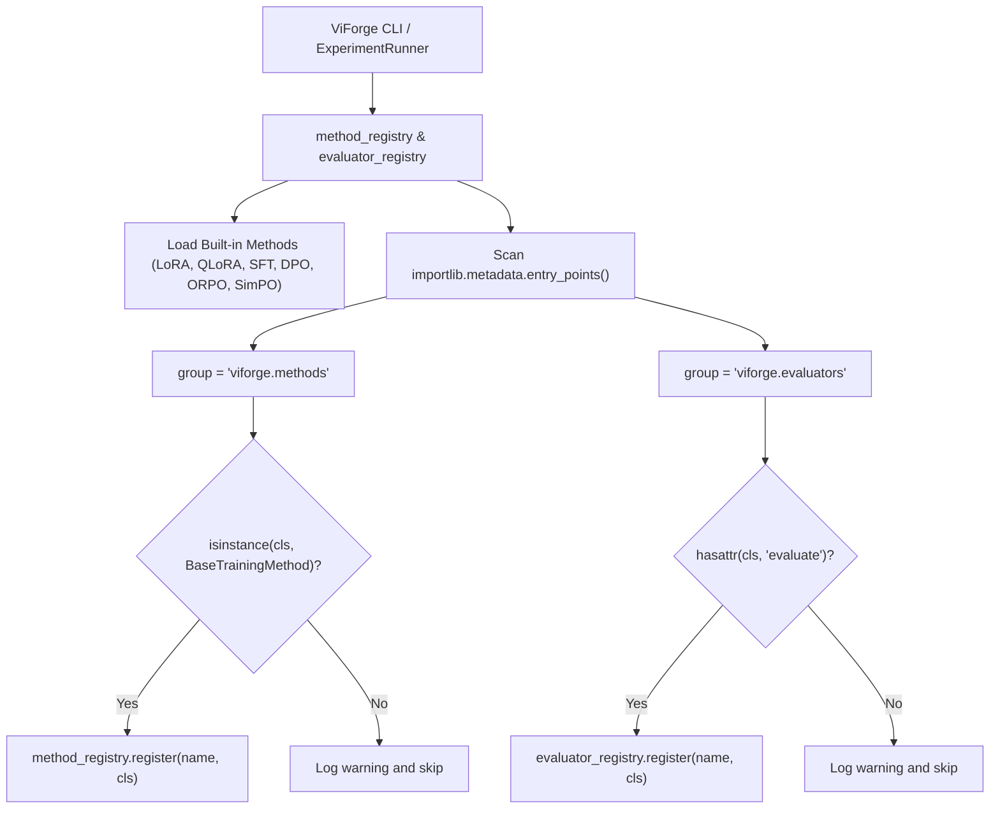

# Plugin Architecture & Extensibility

## Overview

**ViForge** is engineered with a modular, decoupled plugin architecture. Third-party developers, researchers, and enterprises can extend ViForge with custom **Training Methods** and **Evaluation Benchmark Suites** without modifying or forking the core codebase.

ViForge leverages Python's standard `importlib.metadata` entry-point specification:
- `viforge.methods`: Extends post-training specialization strategies (e.g., custom RL algorithms, preference formulations).
- `viforge.evaluators`: Extends evaluation benchmark harnesses and retention suites.

---

## Plugin Discovery Workflow



---

## Authoring a Custom Training Method Plugin

To create an external plugin package (e.g. `viforge-spin-method` implementing Self-Play Fine-Tuning):

### 1. Implement `BaseTrainingMethod`

Create your method class inheriting from `viforge.methods.base.BaseTrainingMethod`:

```python
# viforge_spin/method.py
from pathlib import Path
from typing import Any, Optional
from viforge.methods.base import BaseTrainingMethod
from viforge.config.schemas import StageMetrics, TrainingStageConfig

class SPINMethod(BaseTrainingMethod):
    """Self-Play Fine-Tuning (SPIN) specialization method."""

    @property
    def method_name(self) -> str:
        return "spin"

    def prepare_model(self, model: Any, stage_config: TrainingStageConfig) -> Any:
        # Prepare LoRA adapters or full-parameter setup
        return model

    def execute_stage(
        self,
        model: Any,
        tokenizer: Any,
        train_data_path: Path,
        eval_data_path: Optional[Path],
        stage_config: TrainingStageConfig,
        output_dir: Path,
    ) -> StageMetrics:
        # Execute training loop or delegate to Trainer
        ...
        return StageMetrics(
            stage_id=stage_config.stage_id,
            method=self.method_name,
            training_loss=0.42,
            eval_loss=0.45,
            tokens_processed=100_000,
            tokens_per_second=2400.0,
            peak_vram_gb=18.5,
            trainable_parameters=14_000_000,
            total_parameters=1_540_000_000,
            trainable_ratio_pct=0.91,
            wall_clock_seconds=120.0,
            estimated_stage_cost_usd=0.08,
        )
```

### 2. Declare Entry Point in `pyproject.toml`

In your plugin package's `pyproject.toml`:

```toml
[project]
name = "viforge-spin"
version = "0.1.0"
dependencies = ["viforge>=0.1.0"]

[project.entry-points."viforge.methods"]
spin = "viforge_spin.method:SPINMethod"
```

Once installed into your virtual environment (`pip install viforge-spin` or `pip install -e .`), ViForge will **automatically discover and register** the `spin` method without any manual registration code.

You can verify discovery with:

```bash
viforge list-methods
```

---

## Authoring a Custom Evaluation Benchmark Plugin

To create a custom domain evaluation benchmark (e.g. `viforge-finance-bench`):

### 1. Implement Evaluator Class

```python
# viforge_finance/evaluator.py
from pathlib import Path
from typing import Any
from viforge.config.schemas import BenchmarkResult, SamplingParams
from viforge.inference.backends import BaseInferenceBackend

class FinancialReasoningSuite:
    """Financial Q&A and quantitative modeling benchmark."""

    @property
    def name(self) -> str:
        return "financial_reasoning"

    def evaluate(
        self,
        inference_backend: BaseInferenceBackend,
        output_dir: Path,
        sampling_params: SamplingParams,
        timeout_seconds: int = 15,
        limit: Optional[int] = None,
    ) -> BenchmarkResult:
        ...
        return BenchmarkResult(
            benchmark_name=self.name,
            pass_at_k={"pass@1": 0.84},
            total_problems=100,
            passed_problems=84,
            failed_problems=16,
            execution_time_seconds=22.5,
            raw_metrics={"accuracy_pct": 84.0},
        )
```

### 2. Declare Entry Point

```toml
[project.entry-points."viforge.evaluators"]
financial_reasoning = "viforge_finance.evaluator:FinancialReasoningSuite"
```

Verify discovery with:

```bash
viforge list-evaluators
```

---

## Verification & Best Practices

1. **Keep Imports Lazy:** Avoid expensive imports (like CUDA drivers or heavy weights) at module import time. Defer them inside `execute_stage()` or `evaluate()`.
2. **Handle Mock Mode:** Always handle the case where `model is None` in `execute_stage()` to allow fast, zero-GPU CI tests.
3. **Respect Security Sandboxing:** Evaluation benchmarks executing arbitrary Python code generated by LLMs should invoke `viforge.security.sandbox.ExecutionSandbox`.
