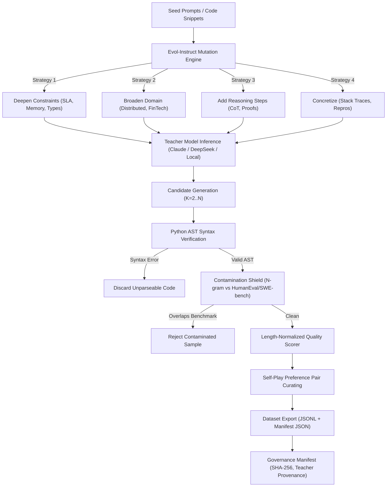

# Synthetic Data Generation & Self-Play Curation

## Overview

In modern post-training pipelines, relying solely on human-annotated data limits scalability and domain coverage. **ViForge** implements an enterprise-grade synthetic data generation and preference curation engine designed to forge small language models (SLMs) into domain specialists.

The synthetic data subsystem combines:
1. **Evol-Instruct Mutation Heuristics**: Automatically escalating task difficulty across 4 core dimensions.
2. **Self-Play Preference Curation**: Generating multi-candidate outputs, verifying code correctness via Python AST parsing, and scoring responses to curate pairwise preference datasets (`chosen` vs `rejected`) for DPO, ORPO, and SimPO.
3. **Length-Bias Mitigation**: Applying length-normalization penalties to prevent preference drift towards overly verbose candidates.
4. **Preventive Contamination Shielding**: Screening candidate samples against known evaluation benchmarks ($N$-gram sliding overlap) prior to dataset persistence.
5. **Cryptographic Governance Manifest**: Emitting SHA-256 hashes, provenance records, and dataset cards with every export.

---

## Architectural Workflow



---

## Evol-Instruct Mutation Taxonomy

ViForge defines 4 orthogonal prompt evolution strategies via `EvolStrategy`:

| Strategy | Enum Key | Objective | Example Prompt Mutation |
| :--- | :--- | :--- | :--- |
| **Deepen Constraints** | `deepen_constraints` | Adds production constraints, memory ceilings, latency budgets, and strict static typing. | *"Rewrite this binary tree search to execute in $O(1)$ auxiliary space and handle concurrent lock-free mutations."* |
| **Broaden Domain** | `broaden_domain` | Extends single-function tasks into distributed, multi-tenant enterprise architectures. | *"Adapt this single-node cache into an eventually consistent, partitioned Raft-backed key-value store."* |
| **Add Reasoning Steps** | `add_reasoning_steps` | Enforces explicit step-by-step architectural trade-off deliberation before implementation. | *"Analyze time-space trade-offs, potential cache invalidation race conditions, and then provide the optimized solution."* |
| **Concretize** | `concretize` | Converts abstract prompts into realistic bug reports, failing integration test suites, or production stack traces. | *"Here is a traceback showing deadlocks under high load. Provide the minimal patch and reproduction test."* |

---

## Self-Play Preference Curation for Reference-Free Alignment

ViForge supports reference-free preference alignment methods such as **ORPO** (Odds Ratio Preference Optimization) and **SimPO** (Simple Preference Optimization) that do not require an active reference policy in GPU memory.

### Scoring & Length-Bias Mitigation Formula

Naive LLM-as-a-judge scorers frequently exhibit **verbosity bias**—favoring longer, conversational explanations regardless of code correctness. ViForge mitigates this directly in `score_candidate`:

$$\text{Score}(c) = \text{Base}(c) - \lambda \cdot \max\left(0, \frac{\text{len}(c) - 2 \cdot L_{\text{target}}}{4 \cdot L_{\text{target}}}\right)$$

Where:
- $\text{Base}(c) = 1.0$ for valid AST; $0.1$ for parse failures; $0.2$ for snippets under `min_code_lines`.
- $L_{\text{target}}$ is the expected character budget (default: 400 chars).
- $\lambda = 0.4$ caps the maximum verbosity penalty.

When comparing Candidate A and Candidate B:
1. If both fail AST verification, the pair is **discarded**.
2. The candidate with higher net score becomes `chosen`, while the lower becomes `rejected`.
3. If scores tie, the cleaner, more concise snippet is designated as `chosen`.
4. The output record includes `prompt`, `chosen`, `rejected`, `margin`, and detailed `provenance`.

---

## Preventive Contamination Shielding

To guarantee rigorous evaluation integrity without data leakage:
- Every candidate sample (prompt + completion) is evaluated by the `ContaminationDetector`.
- An $N$-gram sliding window (default: $N=10$ tokens) computes Jaccard and containment ratios against pre-registered evaluation benchmarks (`humaneval`, `mbpp`, `swe-bench`).
- Any candidate with overlap exceeding `max_allowed_overlap` (default: 5%) is **immediately flagged and omitted** from the final dataset.

---

## Cryptographic Lineage & Governance Manifest

Every dataset exported via `SyntheticDataPipeline.export_to_dataset()` generates an accompanying `.manifest.json` file conforming to the `DatasetGovernanceManifest` schema:

```json
{
  "dataset_id": "swe-synthetic-v1",
  "source_url": "synthetic://claude-3-5-sonnet-20241022",
  "source_type": "synthetic_distill",
  "revision_hash": "a1b2c3d4e5f60718",
  "content_sha256": "e3b0c44298fc1c149afbf4c8996fb92427ae41e4649b934ca495991b7852b855",
  "num_samples": 5000,
  "num_tokens_packed": 1420500,
  "contamination_checked": true,
  "benchmark_overlap_ratio": 0.0,
  "pii_scan_clean": true,
  "secrets_scan_clean": true
}
```

---

## Usage Examples

### CLI Command

```bash
viforge generate-synthetic \
  --input-file data/seed_prompts.jsonl \
  --output-file data/synthetic_train.jsonl \
  --strategy deepen_constraints \
  --min-code-lines 3 \
  --check-contamination
```

### Python API

```python
from viforge.methods.synthetic import SyntheticDataPipeline, EvolStrategy
from viforge.preprocessing.contamination import ContaminationDetector

# 1. Initialize contamination detector with evaluation benchmarks
detector = ContaminationDetector(ngram_size=8, max_allowed_overlap=0.05)
detector.register_benchmark_corpus("humaneval", benchmark_code_snippets)

# 2. Instantiate pipeline
pipeline = SyntheticDataPipeline(
    teacher_model_id="claude-3-5-sonnet-20241022",
    min_code_lines=2,
    contamination_detector=detector,
)

# 3. Mutate a prompt
evolved = pipeline.mutate_prompt(
    "Implement an LRU cache.", 
    strategy=EvolStrategy.DEEPEN_CONSTRAINTS
)

# 4. Curate a preference pair
pair = pipeline.create_preference_pair(
    prompt=evolved,
    candidate_a=clean_fast_code,
    candidate_b=verbose_buggy_code,
)

# 5. Export dataset with governance manifest
pipeline.export_to_dataset(
    examples=[pair],
    output_path="artifacts/synthetic_dpo_pairs.jsonl",
    dataset_id="domain-specialist-dpo-v1",
)
```
